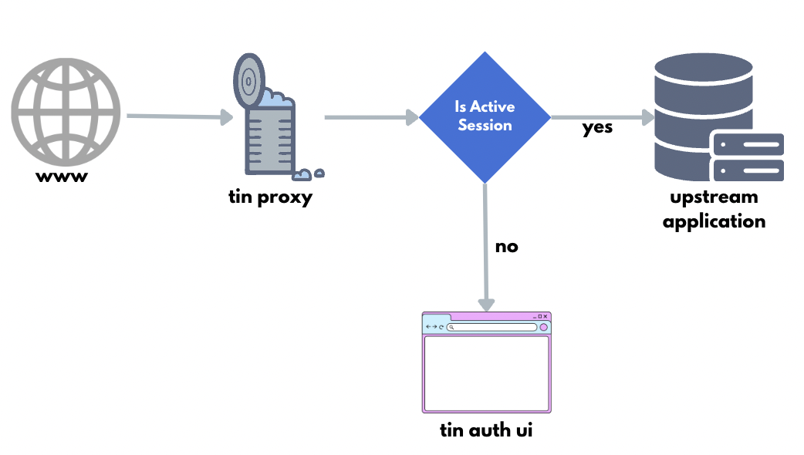

# Tin Auth Proxy Server: Clerk


[](https://app.codacy.com/gh/gemmadlou/tin.auth.proxy/dashboard?utm_source=gh&utm_medium=referral&utm_content=&utm_campaign=Badge_grade)

The Tin Auth Proxy Server handles Clerk session authentication and proxies to an upstream application.



## Motivation

I didn't want to build Clerk into an OSS application I was working on but rather bolt it on. That way others could use the application with their own authentication.

## Features

- Checks, verifies and decodes the `__session` passed from the browser cookie for Clerk.
- Passes through the `X-Forwarded-User` to the upstream application.
- Separates Clerk session handling from the upstream application.

## Important note

- The upstream service should not be accessible from the internet except by the proxy server.
- Does not handle `token` authentication.
- Does not handle authorisation or roles.
- Does not handle organisations currently.

## Pre-requisites

- A clerk account

## Get started

### Setting up the Auth UI server

Install the auth UI.

```bash
git clone git@github.com:gemmadlou/tin.auth.ui.git

cd tin.auth.ui
```

Setup the `VITE_CLERK_PUBLISHABLE_KEY`.

> You can get your Publishable key from the Clerk dashboard.

```bash
echo VITE_CLERK_PUBLISHABLE_KEY=... > .env
```

Start the server.

```bash
yarn dev
```

### Starting the proxy server

Outside of the auth ui project, clone the tin proxy.

```bash
git clone git@github.com:gemmadlou/tin.auth.proxy.git

cd tin.auth.proxy
```

Add your Clerk JWK to the .env file.

> You can get your [JWK json URL](https://clerk.com/docs/backend-requests/handling/manual-jwt#get-your-instance-s-public-key) from Clerk.

```bash
echo JWK_URL=https://clerk.xxxxxxxxxxxxxx.dev/.well-known/jwks.json > .env
```

Add your Auth UI URL to the .env

```bash
echo AUTH_FE_URL=http://localhost:5173/ >> .env
```

Add your upstream app to the .env

```bash
echo PROXY_TARGET_URL=http://localhost:3001/ >> .env
```

Start the proxy server.

```bash
yarn dev
```


## Development

Look at the [Nitro documentation](https://nitro.unjs.io/) to learn more.

### Setup

Make sure to install the dependencies:

```bash
yarn install
```

### Development Server

Start the development server on <http://localhost:3000>

```bash
yarn dev
```

### Production

Build the application for production:

```bash
yarn build
```

Locally preview production build:

```bash
yarn preview
```

Check out the [deployment documentation](https://nitro.unjs.io/deploy) for more information.

## Related projects

- [Oauth2-proxy](https://github.com/oauth2-proxy/oauth2-proxy)
