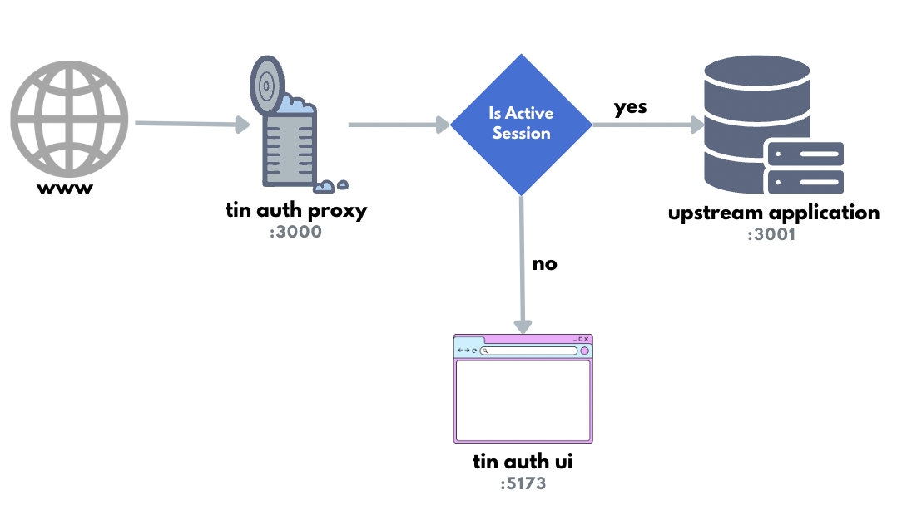

# Tin Auth Proxy Server: Clerk

The Tin Auth Proxy Server handles Clerk session authentication and proxies to an upstream application.



## Motivation

I didn't want to build Clerk into an OSS application I was working on but rather bolt it on. That way others could use my application but instead, work with their own authentication.

## Features

- Checks, verifies and decodes the `__session` passed from the browser cookie.
- Passes through the `X-Forwarded-User` to the upstream application.
- Separates Clerk session handling from the upstream application.

## Important note

- The upstream service should not be accessible from the internet except by the proxy server.
- Does not handle `token` authentication.
- Does not handle authorisation.

## Pre-requisites

- A clerk account

## Development

Look at the [Nitro documentation](https://nitro.unjs.io/) to learn more.

### Setup

Make sure to install the dependencies:

```bash
yarn install
```

### Development Server

Start the development server on <http://localhost:3000>

```bash
yarn dev
```

### Production

Build the application for production:

```bash
yarn build
```

Locally preview production build:

```bash
yarn preview
```

Check out the [deployment documentation](https://nitro.unjs.io/deploy) for more information.

## Related projects

- [Oauth2-proxy](https://github.com/oauth2-proxy/oauth2-proxy)
